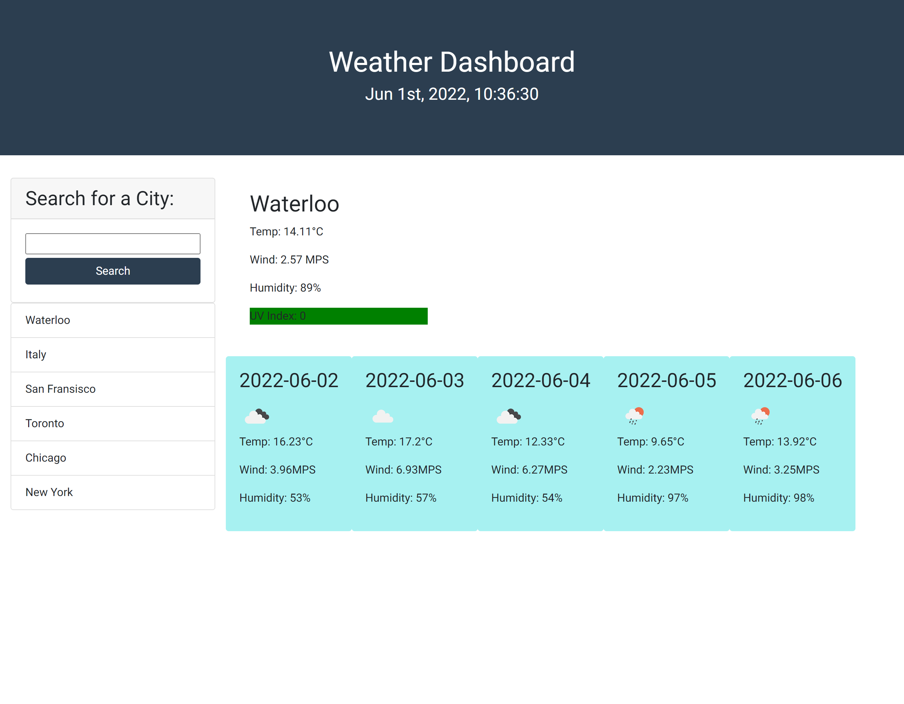

# Weather Dashboard

## Description
This repository contains a weather dashboard that utilizes a server-side API. The user is able to search a city, and receive the current and future five-day forecast. The application uses local storage to track the past city searches that can then be reproduced with the click of a button.   

## Usage

This website can be accessed at https://kevinleekwlee.github.io/weather-dashboard/

Below is a screenshot of the website. 

